# URL mapping(creation),Dynamic URL mapping,views
## Contents
1. [URL mapping(creation)](#URL-mapping)
2. [Dynamic URL mapping](#Dynamic-URL-mapping)

****************************
## URL mapping(creation)

* we have defaultly urls.py in  our created project(College) but we dont have urls.py in our own app so we should create new file with name urls.py in our own App(Students).
* Now we find the Students App in our project(College).
* Now goto Students app folder and create "urls.py" file and add like this

  	```
	from django.urls import path
	from Students import views
	urlpatterns=[
		path('index/',views.index,name="index"),

	]

> _NOTE:_ here i am importing views from Students app and mentioned one path because,if we browse localhost:8000/Students/index then it goes to views part index function and gives return template as a output. 

* goto (Students/views.py file) Students folder open views.py file and add like this.
	```
		
	from django.shortcuts import render
	from django.http import HttpResponse
	def index(request):
			return HttpResponse("<h2>Hello World</h2>")
			
* **HttpResponse  :** is a response class with string data. While HttpRequest is created by Django, HttpResponse is created by programmer.
* Create a function index in the views.py file. This function will be mapped from the Students/urls.py file.

> **_NOTE:_** import HttpResponse from http package and defining the function index.

* goto (College/urls.py file) College folder open urls.py file and add like this.
	
* Django already has mentioned a URL here for the admin. The path function takes the first argument as a route of string or regex type.The view argument is a view function which is used to return a response (template) to the user.


	
		from django.contrib import admin
		from django.urls import path,include
		from appname(Students) import views
		urlpatterns = [
	   		path('admin/', admin.site.urls),
			path('Students/',include('Students.urls'))
			]

* here we are importing the include because all the app urls are need to include in project urls.py file,so we are import include and giving path for browser.
* check in browser. localhost:8000/Students/index


	

* In anothe rway to represent url is without creating urls.py file in app Students add path in project urls.py file and import the Students app views in project urls.py file follow like this...
	```
		from django.contrib import admin
		from django.urls import path
		from appname(Students) import views
		urlpatterns = [
	   		path('admin/', admin.site.urls),
			path('index/',views.index,name='index'),
			]
		

* check in browser. localhost:8000/index


* **You will get Hello World message**

## Dynamic URL mapping

### `for string:`

  **`In Urls.py:adding Dynamic string hello url path`**
  * for that path we will give different values like:
  
         path('urlname/<str:name>',views.funtionname,name='nameoftheurl'),
  * example:
  ````
            path('hello/<str:name>',views.hello,name='hello'),
   ````
  * It looks like(myproject/urls.py):

   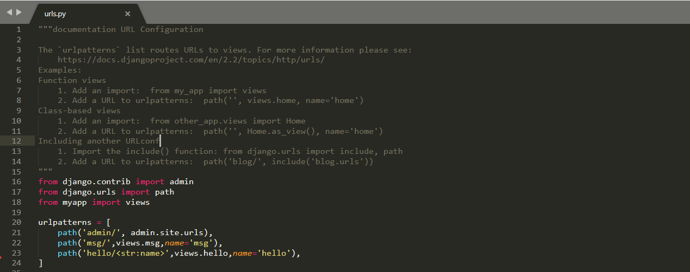
   
   **`In views.py: importing HttpResponse and adding hello function`**
   * In views.py, we have to import HttpResponse, for that add this line in views.py
   
           
            from django.http import HttpResponse
            
   * In views.py we have add a function, with name we used in urls.py that is **hello**
   
   ```
               def hello(request,name):
                   return HttpResponse(<center><h2>Hi '+name+'<br>Welcome to Dynamic String Url</h2></center>)
   ```
   
   > NOTE: In this function, request is a default parameter,we can't change that.
   
   >  NOTE: Remember that in url what u taken as string name, that only passed in this function as a second parameter,it's better                to maintain samename in urls and views(inside function) also.     
        
   
   * It looks like(myapp/views.py):
   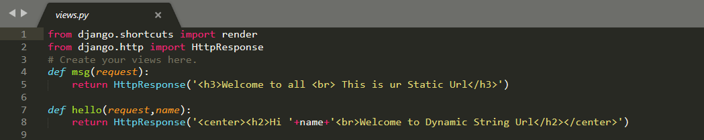
   
   **Run Project:**
   
   * save the changes  and start server using **python manage.py runserver**
   *  Then open chrome:
   
    localhost:8000/url/name
   * example:
      
             localhost:8000/hello/Apssdc
             
   **OutPut for Dynamic String Url:**
   * Then we get OUTPUT it looks like:
   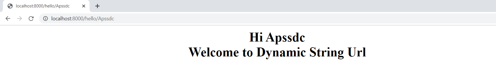

---------------------------------------
### `for Integer:`

  **`In Urls.py:adding Dynamic integer rollno url path`**
  * for that path we will give different values like:
  
         path('urlname/<int:id>',views.funtionname,name='nameoftheurl'),
  * example:
  ````
            path('rollno/<int:id>',views.rollno,name='rollno'),
   ````
  * It looks like(myproject/urls.py):

   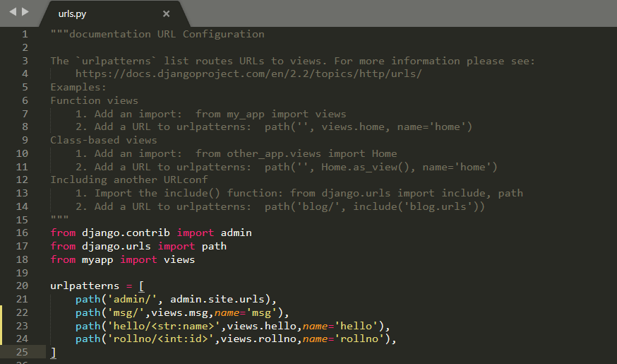
   
   **`In views.py: importing HttpResponse and adding rollno function`**
   * In views.py, we have to import HttpResponse, for that add this line in views.py
   
           
            from django.http import HttpResponse
            
   * In views.py we have add a function, with name we used in urls.py that is **rollno**
   
   ```
               def rollno(request,id):
                   return HttpResponse(<center><h2>Hello {} <br>Welcome to Dynamic Integer Url</h2></center>'.format(id))
   ```
   
   > NOTE:  Remember that in url what u taken as string name, that only passed in this function as a second parameter,it's better to            maintain samename in urls and views(inside function) also. 
    
   > NOTE: In this function, request is a default parameter,we can't change that.
   
   * It looks like(myapp/views.py):
     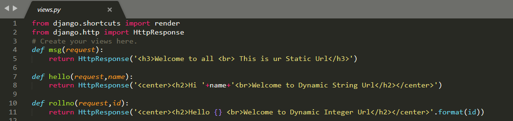
   
   **Run Project:**
   
   * save the changes  and start server using **python manage.py runserver**
   *  Then open chrome:
   
    localhost:8000/url/id
   * example:
      
             localhost:8000/rollno/528
             
   **OutPut for Dynamic integer Url:**
   * Then we get OUTPUT it looks like:
   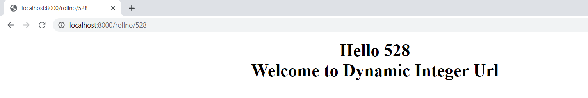

---------------------------------------
  ### `for multiple values:`

  **`In Urls.py:Adding Dynamic multiple values like name, id,mobile url path`**
  * for that path we will give different values like:
  
         path('urlname/<str:name>/<int:id>/<int:mobile>',views.funtionname,name='nameoftheurl'),
  * example:
  ````
            path('studata/<str:name>/<int:id>/<int:mobile>',views.studata,name='studata'),
   ````
  * It looks like(myproject/urls.py):

   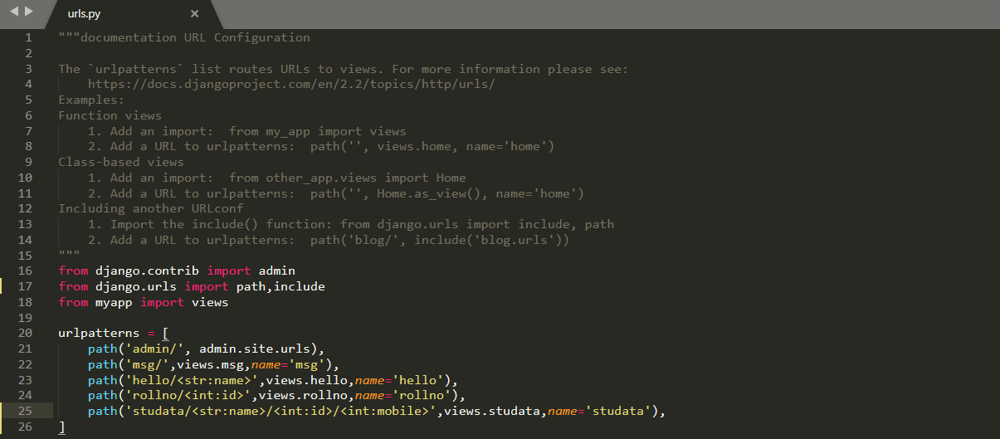
   
   **`In views.py: importing HttpResponse and adding studata function`**
   * In views.py, we have to import HttpResponse, for that add this line in views.py
   
           
            from django.http import HttpResponse
            
   * In views.py we have add a function, with name we used in urls.py that is **studata**
   
   ```
               def studata(request,name,id,mobile):
                   return HttpResponse(<h2>Hello {} <br>Your rollno:{}<br>Your Mobileno:{}</h2>'.format(name,id,mobile))
   ```
   
   > NOTE:  Remember that in url what u taken as string name, that only passed in this function as a second parameter,it's better to            maintain samename in urls and views(inside function) also. 
    
   > NOTE: In this function, request is a default parameter,we can't change that.
   
   * It looks like(myapp/views.py):
     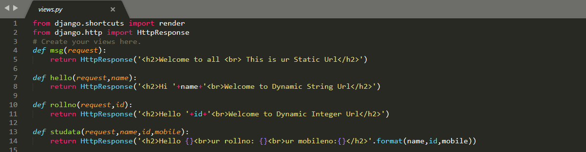
   
   **Run Project:**
   
   * save the changes  and start server using **python manage.py runserver**
   *  Then open chrome:
   
    localhost:8000/url/name/id/mobile
   * example:
      
             localhost:8000/apssdc/528/8887665767
             
   **OutPut for Dynamic integer Url:**
   * Then we get OUTPUT it looks like:
   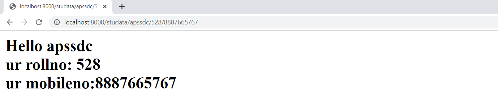

-------------------------------------------

 ### `Configuring Another app Urls :`
 #### Create an Application
* We assume you are in your project folder. In our main “myproject” folder, the same folder then manage.py −

````
$ python manage.py startapp myapp2
````
**`In settings.py:`**
#### Get the Project to Know About Your Application
* At this stage we have our "myapp2" application, now we need to register it with our Django project "myproject". To do so, update INSTALLED_APPS tuple in the settings.py file of your project (add your app name) −

````
# Application definition

INSTALLED_APPS = [
    'django.contrib.admin',
    'django.contrib.auth',
    'django.contrib.contenttypes',
    'django.contrib.sessions',
    'django.contrib.messages',
    'django.contrib.staticfiles',
    'myapp',
    'myapp2',
]
````
------------------------------------------
  **`In myproject/urls.py:`**
  * For adding urls in different app first we have to add **include** in mainurls.py and include myapp2 urls in mainurls.py:
  * for that path we will give different values like:
    
         from django.urls import path,include
        
         path('myapp2/',include('myapp2.urls')),
  
  * It looks like(myproject/urls.py):

   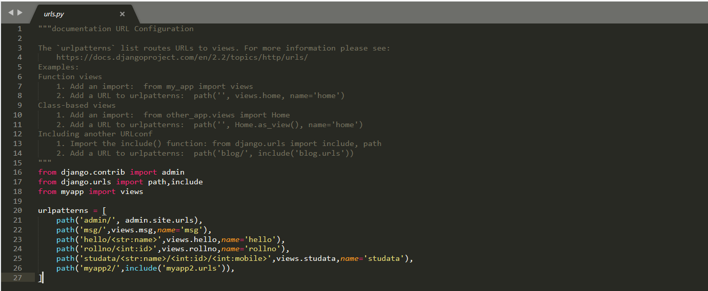
   
   **After including myapp2 urls in myproject/urls.py then in myapp2 we have to create one file,with the name urls.py.**
   * It looks like(myapp2/urls.py):

   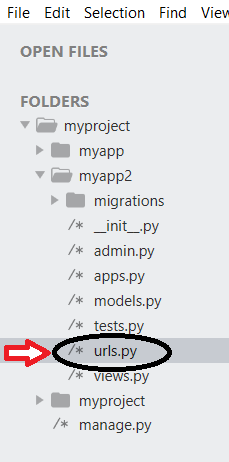
   
   **`In myapp2/urls.py:`**
  * In myapp2/urls.py ,we have to import views from myapp, for that add this line in myapp2/urls.py.
                                
                                from django.urls import path
                                from myapp2 import views

  * In myapp2/urls.py for creating url we will use path function:

          urlpatterns=[
                path(‘data/<str:name>/<int:id>’,views.data,name=’data’),
            ]
  
  * It looks like(myproject/urls.py):

   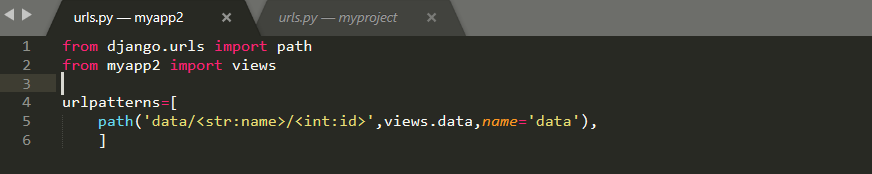
   
   **`In views.py: importing HttpResponse and adding msg function`**
   * In views.py, we have to import HttpResponse, for that add this line in views.py
   
           
            from django.http import HttpResponse
            
   * In views.py we have add a function, with name we used in urls.py that is **data**
   
   ```
               def data(request,name,id):
                   return HttpResponse('<h2>Hello {}<br>ur rollno: {}</h2>'.format(name,id))
   ```
   
   > NOTE: In this function, request is a default parameter,we can't change that.
   
   * It looks like(myapp/views.py):
   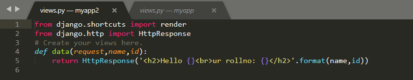
   
   **Run Project:**
   
   * save the changes  and start server using **python manage.py runserver**
   *  Then open chrome:
   
    localhost:8000/myapp2/data/name/id
   * example:
      
             localhost:8000/myapp2/data/stateskilldevelopment/401
             
   **OutPut:**
   * Then we get OUTPUT it looks like:
   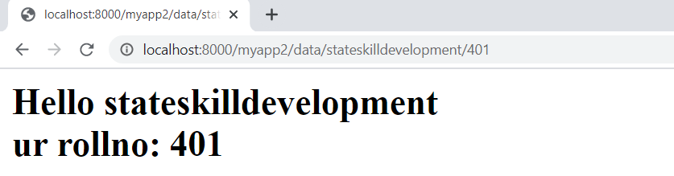

 ------------------------------------------
